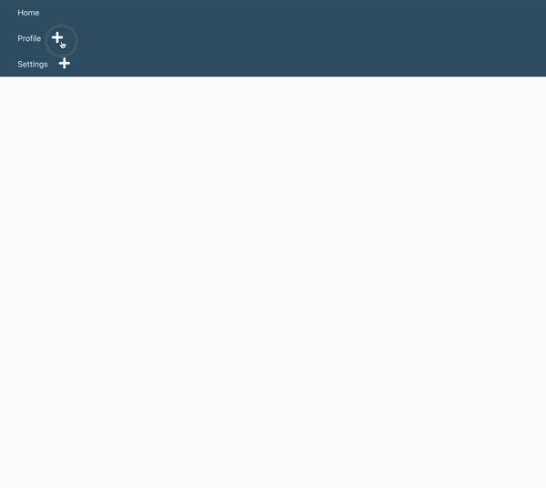

# Nested-Tree-View-Menu-Project

index.jsx
is the main component that initializes the tree view structure. It imports the MenuList component and passes the menus array as a prop to it.
import React from "react";
import "./styles.css";
import MenuList from "./menu-list";

export default function NestedMenu({ menus = [] }) {
  return (
    

      <MenuList list={menus} />
    

  );
}
NestedMenu Component:
Takes a menus prop which defaults to an empty array.
Renders a div with the class tree-view-container.
Renders the MenuList component, passing the menus prop as the list prop.

2. MenuList.jsx
This component is responsible for rendering the list of menu items recursively.
import MenuItem from "./menu-item";
import "./styles.css";

export default function MenuList({ list = [] }) {
  return (
    <ul className="menu-list-container">
      {list && list.length
        ? list.map((listItem) => <MenuItem key={listItem.label} item={listItem} />)
        : null}
    </ul>
  );
}
MenuList Component:
Takes a list prop which defaults to an empty array.
Renders a ul with the class menu-list-container.
Maps over the list array and for each listItem, renders a MenuItem component.
Each MenuItem component is given a unique key prop based on listItem.label.

3. MenuItem.jsx
This component handles the rendering of individual menu items, including handling the display of child menu items.
import { useState } from "react";
import MenuList from "./menu-list";
import { FaMinus, FaPlus } from "react-icons/fa";

export default function MenuItem({ item }) {
  const [displayCurrentChildren, setDisplayCurrentChildren] = useState({});

  function handleToggleChildren(getCurrentLabel) {
    setDisplayCurrentChildren({
      ...displayCurrentChildren,
      [getCurrentLabel]: !displayCurrentChildren[getCurrentLabel],
    });
  }

  console.log(displayCurrentChildren);

  return (
    <li key={item.label}>
      

        
{item.label}

        {item && item.children && item.children.length ? (
           handleToggleChildren(item.label)}>
            {displayCurrentChildren[item.label] ? <FaMinus color="#fff" size={25} /> : <FaPlus color="#fff" size={25} />}
          
        ) : null}
      

      {item &&
      item.children &&
      item.children.length > 0 &&
      displayCurrentChildren[item.label] ? (
        <MenuList list={item.children} />
      ) : null}
    </li>
  );}
MenuItem Component:
Takes an item prop which represents a single menu item.
Uses the useState hook to manage the state of which children are currently displayed.
handleToggleChildren Function:
Toggles the display state of the children for the clicked menu item.
Logs the current state of displayCurrentChildren.
Renders a li element for the menu item.
If the item has children, it renders a clickable span that toggles the display of the children.
Depending on the state of displayCurrentChildren, either the FaMinus or FaPlus icon is shown.
If the item has children and they are currently displayed, it recursively renders a MenuList component with the children.
